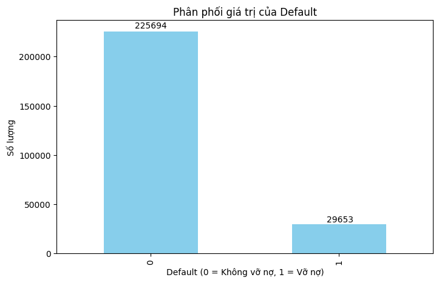
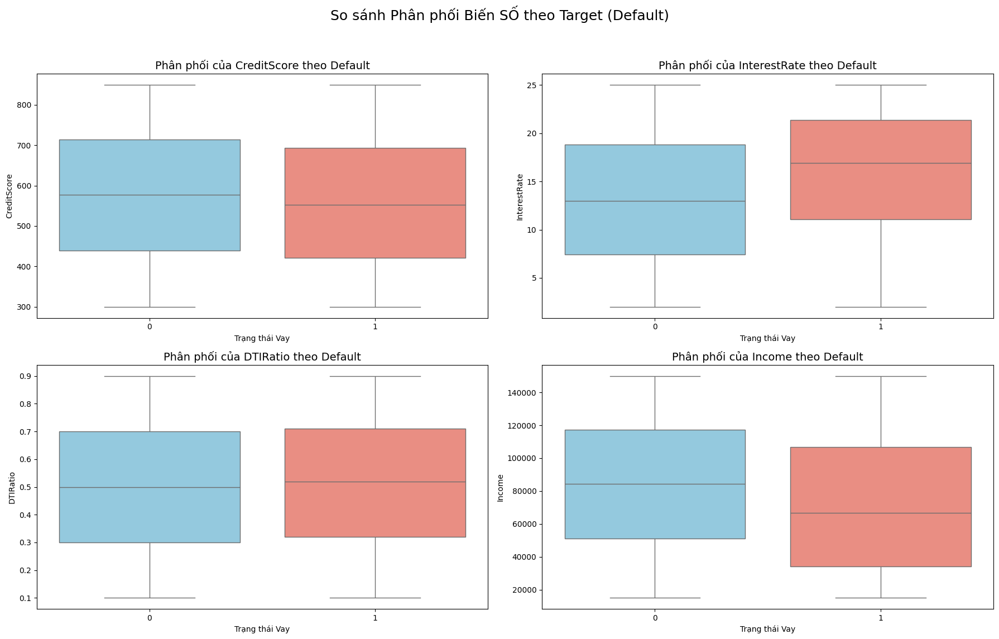
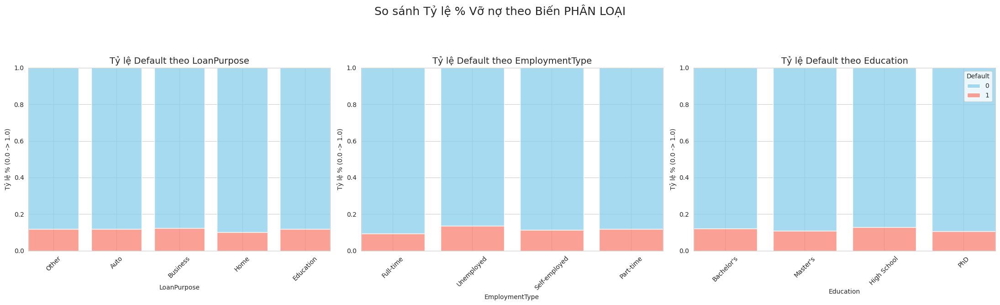
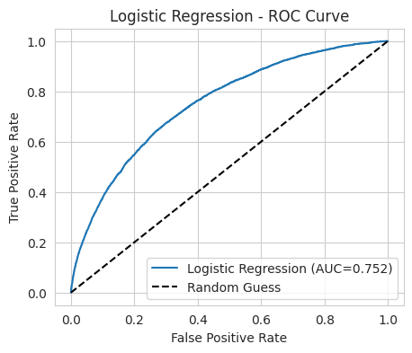

# Đồ án: Dự đoán Rủi ro Tín dụng (Phân tích & Ứng dụng Web)

Dự án này thực hiện hai mục tiêu chính:
1.  **Phân tích (Baseline):** Phân tích, trực quan hóa và huấn luyện 5 mô hình Machine Learning (XGBoost, Random Forest, Logistic Regression, SVM, Decision Tree) để tìm ra mô hình dự đoán rủi ro vỡ nợ tốt nhất.
2.  **Ứng dụng (App):** Triển khai mô hình (Logistic Regression) lên một ứng dụng web bằng Flask, hoạt động như một hệ thống hỗ trợ ra quyết định nghiệp vụ.

---

## 1. 📊 Phân tích & Baseline (EDA)

Toàn bộ quá trình phân tích chi tiết được trình bày trong file Jupyter Notebook:
➡️ **[Xem file phân tích đầy đủ tại đây: Loan_Risk_Prediction.ipynb](Loan_Risk_Prediction.ipynb)**

Dưới đây là tóm tắt các phát hiện (insight) quan trọng nhất từ quá trình phân tích:

### 1.1. Vấn đề Mất cân bằng (Bài toán chính)

Phân tích biến mục tiêu `Default` cho thấy bộ dữ liệu mất cân bằng nghiêm trọng.



**Nhận xét:** Dữ liệu chỉ có **11.62%** là "Vỡ nợ" (lớp 1). Điều này khẳng định đây là một thách thức lớn, đòi hỏi phải sử dụng các kỹ thuật xử lý (như RandomOverSampler) và tập trung vào **metric Recall** (khả năng phát hiện) thay vì Accuracy.

### 1.2. Phân tích Tương quan (Tìm insight)

So sánh các biến độc lập với biến mục tiêu `Default` cho thấy các tín hiệu dự đoán rất rõ ràng.




**Nhận xét:**
* **Điểm tín dụng (CreditScore):** Nhóm "Vỡ nợ" (lớp 1) có điểm tín dụng **thấp hơn rõ rệt** so với nhóm "Không Vỡ nợ" (lớp 0).
* **Lãi suất (InterestRate):** Ngược lại, nhóm "Vỡ nợ" có phân phối lãi suất **cao hơn hẳn**.
* **Hồ sơ rủi ro cao:** Tỷ lệ vỡ nợ cao nhất ở các nhóm: **Thất nghiệp (Unemployed)**, **Tự kinh doanh (Self-employed)**, vay để **Kinh doanh (Business)** và có trình độ **Trung học (High School)**.

---

## 2. 🤖 Huấn luyện & Lựa chọn Mô hình

5 mô hình đã được huấn luyện và so sánh. Tiêu chí lựa chọn hàng đầu là **Recall (lớp 1)** (khả năng phát hiện vỡ nợ) và **ROC-AUC** (khả năng phân loại tổng thể).

### 2.1. So sánh Kết quả

| Mô hình | Recall (lớp 1) | Precision (lớp 1) | ROC-AUC | Ghi chú |
| :--- | :---: | :---: | :---: | :--- |
| **Logistic Regression** | **0.70** | 0.22 | **0.752** | **Lựa chọn** (Recall cao, Nhanh) |
| **SVM** | **0.70** | 0.22 | **0.752** | Recall cao, nhưng rất chậm |
| XGBoost | 0.68 | 0.23 | 0.757 | Hiệu suất tốt |
| Random Forest | 0.68 | 0.22 | 0.747 | Tương tự XGBoost |
| Decision Tree | 0.66 | 0.21 | 0.724 | Hiệu suất thấp nhất |

### 2.2. Lựa chọn Mô hình

Mô hình **Logistic Regression** được lựa chọn để triển khai vì:
1.  Đạt **Recall (lớp 1) cao nhất** (70%), ngang bằng SVM, "bắt" được nhiều ca rủi ro nhất.
2.  Thời gian huấn luyện và dự đoán cực kỳ nhanh, phù hợp cho ứng dụng web.
3.  Có khả năng diễn giải (interpretability), điều quan trọng trong tài chính.

*(Thay tên file ảnh bên dưới bằng tên file thật)*


---

## 3. 🚀 Ứng dụng Web (Flask App)

Ứng dụng "CreditVision" được xây dựng để triển khai mô hình Logistic Regression đã chọn. Ứng dụng mô phỏng công cụ của chuyên viên tín dụng, sử dụng logic "Đèn giao thông" (Xanh/Vàng/Đỏ) để hỗ trợ ra quyết định.

*(Thay tên file ảnh bên dưới bằng tên file thật)*


### Hướng dẫn chạy

1.  Tải về hoặc clone repo này.
2.  Cài đặt các thư viện cần thiết:
    ```bash
    pip install -r requirements.txt
    ```
3.  Chạy ứng dụng:
    ```bash
    python app.py
    ```
4.  Mở trình duyệt và truy cập:
    `http://127.0.0.1:5000`
